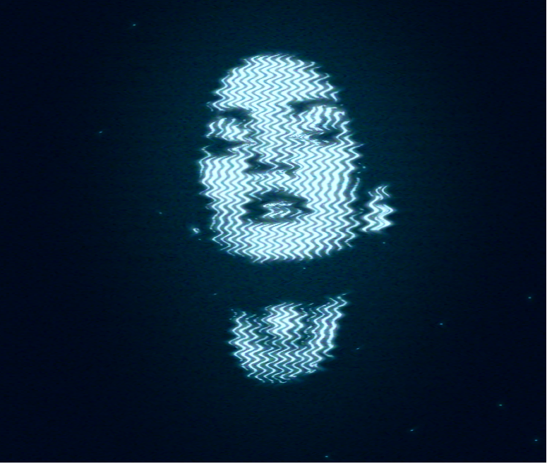

An open source project to turn photos into oscillating wave animations. The animation is created directly in the browser, using an HTML5 canvas element.

Live website: https://collidingscopes.github.io/shimmer

Built using javascript, HTML, CSS.

Enormous thanks and credits to <a href="https://stackoverflow.com/questions/29586754/how-can-i-recreate-this-wavy-image-effect" target="_blank" rel="noopener">user1693593 from StackOverflow</a>, who provided the initial code to create this effect.

License
=======
This is an open source project provided under an <a href="https://opensource.org/license/MIT">MIT license</a>